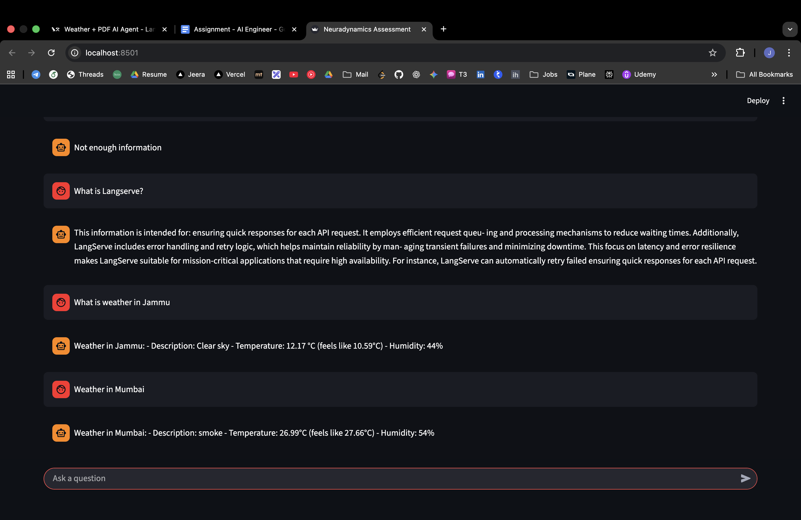
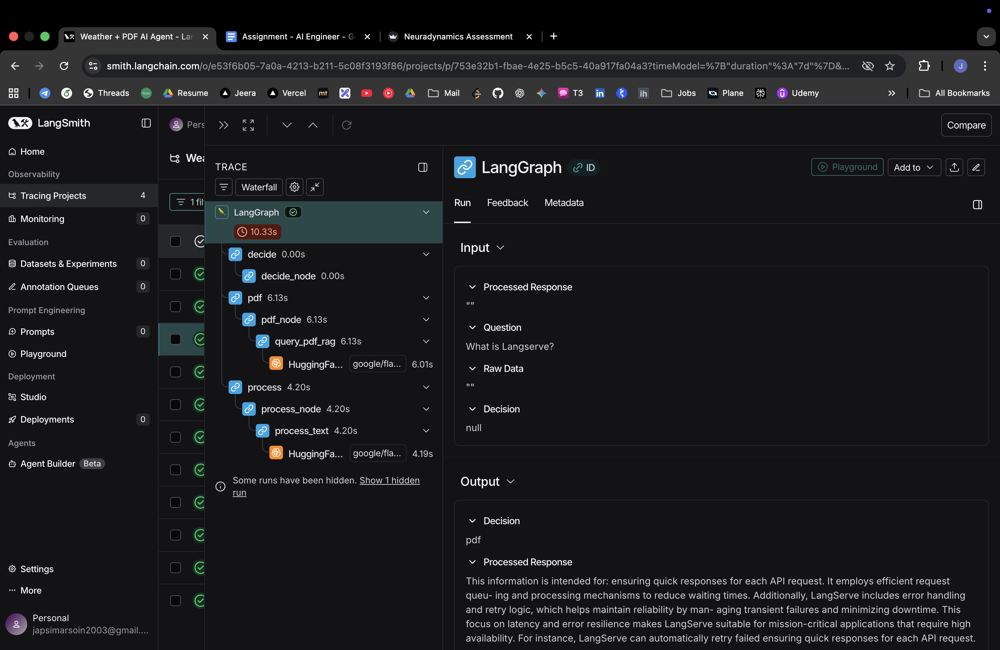
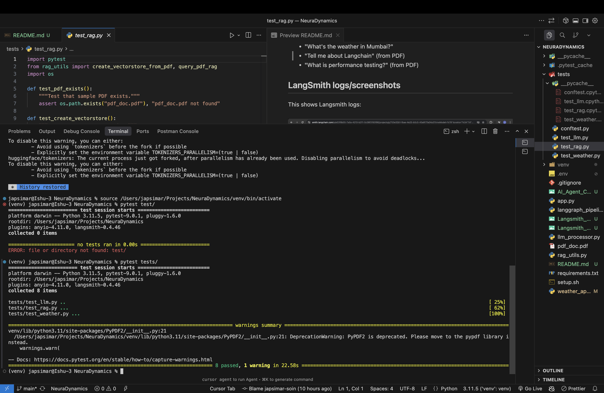

# Weather + PDF AI Agent

## Setup instructions:
1. Set `OPENWEATHER_API_KEY` environment variable from [openweathermap.org](https://openweathermap.org/api)
2. Place any pdf with title `pdf_doc.pdf` in root directory of project
3. Set up `LangSmith API key` for tracing
4. Activate virtual environment in your directory
5. Run the command: `streamlit run app.py`

Note: I have set it up in a docker container, so also need to run: `docker-compose up -d qdrant` (qdrant and streamlit apps are running in separate docker containers)

---
PDF Link in my project: [LangChain](https://www.researchgate.net/publication/385681151_LangChain)

## How to use?

**Try asking:**
- "What's the weather in Mumbai?"
- "Tell me about Langchain" (from PDF)
- "What is performance testing?" (from PDF)

## IMPORTANT LINKS:
- [Github repo](https://github.com/japsimar-soin/AI_Pipeline_Langchain)
- [Loom Video](https://www.loom.com/share/1a28bd516cff411b8ffaeb615c533311)
- [PDF used in project](https://www.researchgate.net/publication/385681151_LangChain)

## LangSmith logs/screenshots
Streamlit app demo:

---
This shows Langsmith logs:

---
For the following chat with LLM:

---
LangSmith Trace for pdf query:

---
Test Results form unit tests:

